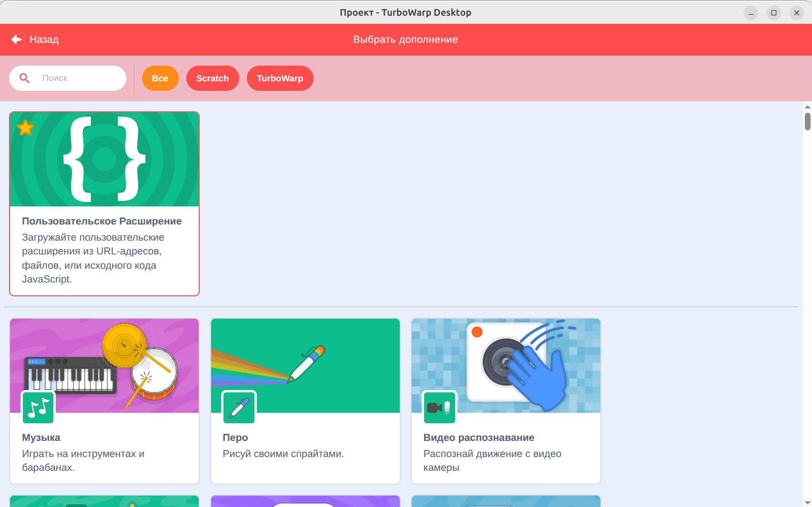
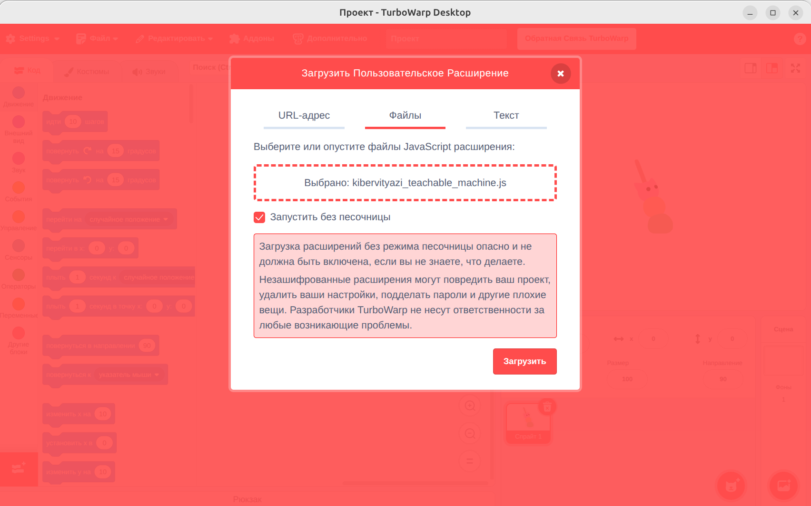
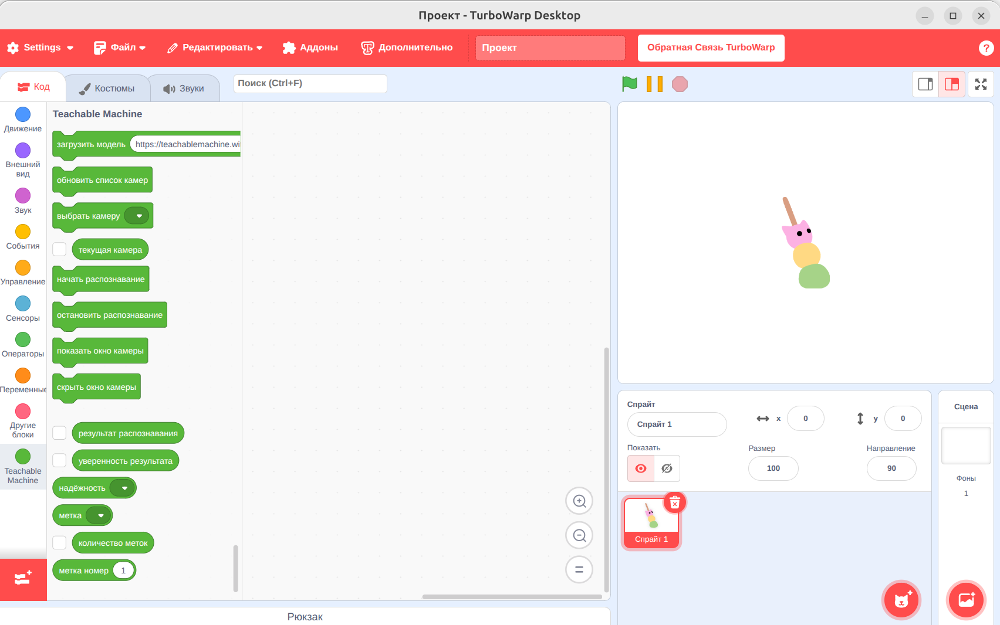
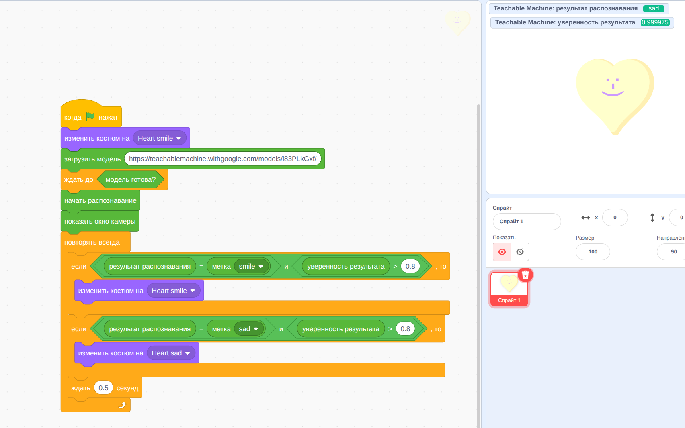

# Teachable Machine для TurboWarp

## 1. Подключение к TurboWarp

1. Откройте TurboWarp.
2. Нажмите **Расширения → Пользовательское расширение**.
3. Выберите файл `kibervityazi_teachable_machine.js`.
4. Включите **Запускать без песочницы**.
5. Загрузите расширение.

  
  
  

Запускать локальный сервер для этого способа **не нужно**.

## 2. Минимальная программа

1. `загрузить модель [https://teachablemachine.withgoogle.com/models/XXXXXXXXX/]`
2. `ждать до <модель готова?>`
3. `начать распознавание`
4. `показать окно камеры`
5. В цикле сравнивать:

   `если <(результат распознавания) = (метка [яблоко])> и <(надёжность [яблоко]) > 0.8>`

  

## Блоки

- загрузить модель по URL;
- начать/остановить распознавание;
- показать/скрыть окно камеры;
- результат распознавания;
- уверенность результата (0..1);
- надёжность выбранной метки (0..1);
- **метка [список]** — выбранная метка для вставки в сравнение;
- количество меток и метка по номеру;
- статус модели.

## Важно

- Для загрузки библиотек и модели требуется доступ к интернету.
- Ссылка должна оканчиваться на `/`, например:
  `https://teachablemachine.withgoogle.com/models/l83PLkGxf/`
- Закройте вкладку Teachable Machine после сохранения/публикации модели, чтобы она не занимала камеру.
- Порог 80% задаётся числом `0.8`.
